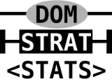

# DomStratStats: Domain Stratified Statistics

Stratified statistics for protein domains.
Compute domain q-values and local FDRs, and tiered q-values (combining HMMER3 domain and sequence data).

Here you can download our code, and learn how to use it.
This page is the software's manual.

# About DomStratStats

The goal of this software is to bring better statistics to protein sequence analysis.
The standard approaches are based on p-values and E-values, but here we introduce q-values and lFDRs (local False Discovery Rates) for protein domains.
They key to make q-values and lFDRs work better is by stratifying, in this case analyzing each domain family separately, which best balances noise across domain families.

Practically, the "domain q-value" approach will be the most useful.
Theoretically, we proved in our work that lFDRs are optimal; however, we found in benchmarks that lFDR estimates do not perform as well as q-values because some HMMER3 p-values are bad (for certain repetitive domain families, in particular).
We found that q-values are much more robust than lFDRs given the p-values that HMMER3 gives.
Our code provides lFDRs anyway for research purposes, and with the hope that they can be better used in the future, when domain p-values improve.

Lastly, we included an even more experimental mode, "tiered q-values".
Our tiered analysis combines the HMMER sequence and domain p-values into a joint assessment of significance based on the FDR.
On the plus side, it produces even more predictions at a fixed combined FDR than the previous approaches.
However, the theoretical FDR is too far off of the empirical FDR, which means that you should exercise caution choosing which threshold to use.

# Installation

## Dependencies 

You'll need 

- Perl 5
- `gzip`
- The [HMMER3](http://hmmer.janelia.org/) protein hidden Markov model software
- Git versioning control software (optional, to clone repository)

For the HMM database, you have two options.

- Pfam: prefered for DomStratStats, download instructions below.
- Superfamily: less supported.
  Register and download `hmmlib_1.75.gz` from [Superfamily](http://supfam.org/SUPERFAMILY/downloads.html).
  Use HMMER3's hmmpress to prepare database for searching (follow Pfam's instructions).
  However, the latest HMMER 3.2.1 version didn't work with Superfamily anymore (its HMMs do not have unique IDs), so some hacks will be needed to get this to work fully.

## Cloning repository

You can download a ZIP copy of this repository on GitHub.
However, cloning the repository has many advantages.
You can clone it with this command:
```bash
git clone https://github.com/alexviiia/DomStratStats.git
```
If there are any updates in the future, you can simply update your copy of the repository by typing, inside the `DomStratStats` directory:
```bash
git pull
```

## Running scripts from arbitrary directories

Each script can be run easily from the directory that contains it (and its `*.pm` Perl module dependencies).
For example, if you cloned this repository onto the local directory `DomStratStats/`, on a terminal you can run one of the help messages by typing:
```bash
cd DomStratStats/ 
perl -w 2domStratStats.pl # <ARGS>... 
```

To run the scripts from other directories, you have to specify the directory containing the `*.pm` Perl modules using the `-I` option for `perl`, like so:
```bash
cd ..
perl -IDomStratStats/ -w DomStratStats/2domStratStats.pl # <ARGS>...
```
Note that the home directory shortcut `~` doesn't work with `-I`, but you can use `$HOME` instead.
So if the code is in `~/DomStratStats/`, then this will work:
```bash
perl -I$HOME/DomStratStats/ -w ~/DomStratStats/2domStratStats.pl # <ARGS>...
```

## Pfam database

For the HMM database, you will need to download `Pfam-A.hmm.gz` and `Pfam-A.hmm.dat.gz` from [Pfam](ftp://ftp.ebi.ac.uk/pub/databases/Pfam/current_release/). 
Use HMMER3's hmmpress to prepare database for searching.
A minimal set of commands is:
```bash
# download files
wget ftp://ftp.ebi.ac.uk/pub/databases/Pfam/current_release/Pfam-A.hmm.gz
wget ftp://ftp.ebi.ac.uk/pub/databases/Pfam/current_release/Pfam-A.hmm.dat.gz
# uncompress Pfam-A.hmm, while keeping compressed version around
gunzip -k Pfam-A.hmm.gz
# press the database
hmmpress Pfam-A.hmm
# remove temporary uncompressed copy (no longer needed)
rm Pfam-A.hmm
```

# Running the scripts

## Recommendations

The scripts do not come with default thresholds for q-values or lFDRs.
Different thresholds will allow for different balances of true and false positives.
If you want predictions that are comparable in quality to Pfam, our benchmarks suggest a q-value threshold of 4e-4 (most recommended), or an lFDR threshold of 2.5e-2 (lFDRs are less recommended in general), or a tiered q-value threshold of 1e-4 (for each tier, but FDRs are inaccurate in this mode).
But in some ways Pfam is too conservative, so if you prefer you can set more lenient thresholds.
For example, q <= 1e-3 should give one false positive for every 1000 domains (although the true FDR might be higher if your sequences contain coiled coils, transmembrane domains, or other low-complexity regions, so watch out!).

The FDRs and lFDRs we compute become more accurate when datasets are larger.
In practice, we found that the proteins from a single organism are not enough to give optimal results, but grouping many related organisms performs very well (for example, I usually work with 15 organisms of the phylum Apicomplexa).
The examples below break this rule, they only use *Plasmodium falciparum* for the sake of having small inputs and outputs.
In general, it is better to start from a larger collection of proteins that represent the diversity of the domains contained in the organism you're studying (such as the Apicomplexa, in the case of *P. falciparum*, as I did for [this other project](http://viiia.org/dssApi)).
The lFDRs are much more sensitive than q-values to the size of the input data.


## Sample files

This repository contains the following sample files:

Sample input:

- [`sample/PLAF7.fa`](sample/PLAF7.fa): the *Plasmodium falciparum* proteome from [PlasmoDB](http://plasmodb.org/plasmo/) version 11.0, with pseudogenes removed, containing 5441 proteins.

Sample outputs:

- [`sample/PLAF7.p.txt`](sample/PLAF7.p.txt): HMMER3/Pfam32 domain predictions using weak filters (produced by `0runHmmscan.pl` as below).
- [`sample/PLAF7.po.txt`](sample/PLAF7.po.txt): Domain predictions with overlaps removed, using the previous sample as input (produced by `1noOvs.pl` as below).
- [`sample/PLAF7.pod.txt`](sample/PLAF7.pod.txt): Domain predictions with q-values, local FDRs and FDR|lFDR columsn added, using the previous sample as input (produced by `2domStratStats.pl` as in the first command below).

## Synopsis of scripts

All scripts give detailed usage instructions when executed without arguments.
The following commands can be run on the sample file placed in the same directory as the code and called from that location.
The input file may be compressed with `gzip` and may be specified with or without the GZ extension.
The output file is compressed with `gzip`, whether the outputs indicate a GZ extension or not.
So the commands as they are below produce and will work entirely with compressed files, without a single GZ extension indicated.

Produce domain predictions with HMMER3 (provides hmmscan) with weak filters.
This is the slowest step.
```bash
perl -w 0runHmmscan.pl hmmscan Pfam-A.hmm PLAF7.fa PLAF7.p.txt 
```

(Optional) compress output, our scripts will read it either way 
```bash
gzip PLAF7.p.txt 
```

Remove overlaps, ranking by p-value, creating an intermediate output file 
```bash
perl -w 1noOvs.pl PLAF7.p.txt PLAF7.po.txt Pfam-A.hmm.dat 
```

Add domain q-value, local FDR, and FDR|lFDR columns (no thresholds set) 
```bash
perl -w 2domStratStats.pl PLAF7.fa PLAF7.po.txt PLAF7.pod.txt 
```

... and set a q-value threshold 
```bash
perl -w 2domStratStats.pl PLAF7.fa PLAF7.po.txt PLAF7.pod.q4e-4.txt 4e-4 
```

... or set a local FDR threshold 
```bash
perl -w 2domStratStats.pl PLAF7.fa PLAF7.po.txt PLAF7.pod.l2.5e-2.txt 1 2.5e-2 
```

... or set an FDR threshold via equal local FDR thresholds 
```bash
perl -w 2domStratStats.pl PLAF7.fa PLAF7.po.txt PLAF7.pod.fl4e-4.txt 1 1 4e-4 
```
Tiered q-values (for sequence and domain p-values), with mandatory threshold set 
```bash
perl -w 3tieredStratQ.pl PLAF7.fa PLAF7.po.txt PLAF7.pot.1e-4.txt 1e-4 
```

... or threshold set to sequence q-values only 
```bash
perl -w 3tieredStratQ.pl PLAF7.fa PLAF7.po.txt PLAF7.pot.1e-4,1.txt 1e-4 1 
```

Run entire pipeline on multiple organisms, pooling their stats.
Pass prefixes ORG instead of ORG.fa or ORG.fa.gz.
Outputs follow patterns (see detailed examples) 
```bash
perl -w 4allManyOrgs.pl hmmscan Pfam-A.hmm Pfam-A.hmm.dat Pf Pv Pk Py Pb Pc Bb Ta Tp Tg Nc Et Ch Cp Cm
```

## Using `0runHmmscan.pl`: Get domain predictions from your protein sequences

This is the help message you get by running the script without arguments:
```bash
perl -w 0runHmmscan.pl
```
```
# 0runHmmscan.pl: Get domain predictions from your protein sequences
# DomStratStats 1.05 - https://github.com/alexviiia/DomStratStats
# - - - - - - - - - - - - - - - - - - - - - - - - - - - - - - - - - - - - - - - - - - - - -

Usage: perl -w 0runHmmscan.pl <hmmscan> <Pfam-A.hmm> <FASTA input> <output table> \
         [<file stdout>]

The required inputs are
    <hmmscan>      the path to the HMMER3 hmmscan executable.
    <Pfam-A.hmm>   the path to your HMM library of choice (in HMMER3 format).
    <FASTA input>  the FASTA sequence file, may be compressed with gzip.
    <output table> the hmmscan output is plain text table delimited by whitespace (always
                   uncompressed).

The optional input is
    <file stdout>  the file to which hmmscan's standard output goes, including alignments
                   (default /dev/null)

This script changes hmmscan parameters that are important for dPUC and DomStratStats to
work.  In particular, it forces outputs to report p-values in place of E-values, and it 
relaxes the heuristic p-value filters to allow more predictions through.  This script sets 
the most stringent p-value threshold at 1e-4.
```

If we desire predictions with q <= 4e-4 on UniRef50, we found that we must keep p-values as large as 1e-5 (however, for most families the effective \(p\)-value threshold is much smaller).
Note that the p-value threshold of 1e-4 here ensures that nothing is missed by the domain stratified q-value analysis.

Run on the sample file provided here, which is a standard FASTA file that looks like this (abbreviated):
```
>mal_mito_3
MNFYSINLVKAHLINYPCPL...
>mal_mito_1
FILFSNLSNIKAHLVSYPAL...
...
```
The main output is a large table that looks like this (abbreviated and split into 2 columns):
```
#                                                                            --- full sequence --- 
# target name        accession   tlen query name           accession   qlen   E-value  score  bias 
#------------------- ---------- ----- -------------------- ---------- ----- --------- ------ ----- 
Cytochrome_B         PF00033.19   189 mal_mito_3           -            376   3.1e-61  192.6  25.3 
Cytochrom_B_N_2      PF13631.6    169 mal_mito_3           -            376   3.7e-29   88.0  12.0 
Cytochrom_B_C        PF00032.17   103 mal_mito_3           -            376   1.4e-23   69.4   6.7 
DUF4405              PF14358.6     66 mal_mito_3           -            376   2.2e-06   14.5   4.1 
COX3                 PF00510.18   258 mal_mito_1           -            250   5.4e-23   68.2  34.0 
DUF4860              PF16152.5     97 mal_mito_1           -            250   1.7e-05   10.9   0.2 
COX1                 PF00115.20   432 mal_mito_2           -            478  6.4e-118  380.3  53.8 
DUF4134              PF13572.6     93 mal_mito_2           -            478   6.8e-06   12.7   2.0 
...
```
```
-------------- this domain -------------   hmm coord   ali coord   env coord
  #  of  c-Evalue  i-Evalue  score  bias  from    to  from    to  from    to  acc description of target
--- --- --------- --------- ------ ----- ----- ----- ----- ----- ----- ----- ---- ---------------------
  1   1   3.1e-61   3.1e-61  192.6  25.3     2   188    14   194    13   195 0.96 Cytochrome b/b6/petB
  1   1   3.7e-29   3.7e-29   88.0  12.0     4   164    86   240    83   263 0.87 Cytochrome b(N-termin...
  1   1   1.4e-23   1.4e-23   69.4   6.7     3   103   250   353   248   353 0.89 Cytochrome b(C-termin...
  1   1   2.2e-06   2.2e-06   14.5   4.1     4    63    30    94    28    95 0.87 Domain of unknown fun...
  1   1   1.3e-22   1.3e-22   67.0  32.2    71   254    57   248    49   249 0.82 Cytochrome c oxidase ...
  1   1   3.3e-05   3.3e-05   10.0   0.2    27    54   153   180   150   181 0.90 Domain of unknown fun...
  1   1  7.3e-118  7.3e-118  380.1  53.8     2   432    19   469    18   469 0.95 Cytochrome C and Quin...
  1   1   2.7e-05   2.7e-05   10.7   2.0     9    93   352   439   345   439 0.78 Domain of unknown fun...
...
```
Although the file still calls the various columns by "E-value", they are all are p-values when output by `0runHmmscan.pl`.

## Using `1noOvs.pl`: Remove overlapping domains ranking by p-value

This is the help message you get by running the script without arguments:
```bash
perl -w 1noOvs.pl
```
```
# 1noOvs.pl: Remove overlapping domains ranking by p-value
# DomStratStats 1.05 - https://github.com/alexviiia/DomStratStats
# - - - - - - - - - - - - - - - - - - - - - - - - - - - - - - - - - - - - - - - - - - - - -

Usage: perl -w 1noOvs.pl <input table> <output table> [<Pfam-A.hmm.dat>]

The required inputs are
    <input table>    the output from hmmscan (previous script).
    <output table>   input with some domains removed. Format is identical to input.

This is an additional optional input, which is specific to Pfam.
    <Pfam-A.hmm.dat> only used to identify domains that may nest.

Input files may be compressed with gzip, and may be specified with or without the .gz 
extension.  Output file will be automatically compressed with gzip.

The easiest way to compute correct FDRs and lFDRs is to first remove overlaps between 
domains, raking by p-value, which is what this script does.  A permissive overlap 
definition is used: only overlaps that exceed 40 amino acids or 50% of the length of the 
smaller domain are removed.  These parameters are hardcoded in the script.
```

Overlap removal is essentially performed ultimately between the best predictions, which is common practice between predictions of the same Pfam clan or superfamily.
However, this scripts removes overlaps between all families, not relying on curated relationships between HMMs.
It performs excellently if the ultimate threshold is reasonable (for example, q <= 4e-4), but this step might lead to overly conservative statistics (particularly lFDRs appear much worse than they really are) for much weaker predictions.

## Using `2domStratStats.pl`: Compute and add domain q-values, local FDRs, and FDR|lFDR

This is the help message you get by running the script without arguments:
```bash
perl -w 2domStratStats.pl
```
```
# 2domStratStats.pl: Compute and add domain q-values, local FDRs, and FDR|lFDR
# DomStratStats 1.05 - https://github.com/alexviiia/DomStratStats
# - - - - - - - - - - - - - - - - - - - - - - - - - - - - - - - - - - - - - - - - - - - - -

Usage: perl -w 2domStratStats.pl <FASTA input> <input table> <output table> \
         [<q-value> <local FDR> <FDR|lFDR>]

The required inputs are
    <FASTA input>  the FASTA sequence file, used to count all proteins.
    <input table>  the output from 1noOvs.pl (previous script).
    <output table> every input line has three columns added (unless thresolds are set).

The following optional thresholds may be set. Either or all can be set simultaneously, 
    which is supported although it is unusual and hard to interpret, so avoid using this 
    feature.  Use 1 for any threshold you don't wish to set but must list (for example, to 
    only set an FDR|lFDR threshold, set both the q-value and local FDR thresholds to 1).
    <q-value>      stratified domain q-value threshold. Sets FDR per family.
    <local FDR>    stratified domain local FDR threshold. Sets minimum posterior error
                   probability per family.
    <FDR|lFDR>     threshold on combined FDR across domain families implied by a stratified
                   domain local FDR threshold. Sets a stratified domain local FDR threshold 
                   indirectly, by specifying the resulting combined FDR instead.

Input files may be compressed with gzip, and may be specified with or without the .gz 
extension.  Output file will be automatically compressed with gzip.

This is the most basic approach to FDR control.  If you just want domain predictions at an 
FDR equal to Pfam's, set q <= 4e-4 or some other q-value threshold.  Regard lFDRs and 
FDR|lFDR as experimental features worthy of further research, at least for the moment.

Note that the FDR|lFDR is monotonic with the stratified domain lFDR, but not with stratified 
domain q-values.  When lFDRs are accurate (this is a big if!), they provide the optimal way 
of controlling the combined FDR through FDR|lFDR.
```
When applied to the sample output file from `1noOvs.pl`, provided in `sample/PLAF7.po.txt`, without thresholds, we obtain an output file `sample/PLAF7.pod.txt` that has three new columns added toward the end of the table, just as in this abbreviated version (also note the terrible lFDR estimates compared to q-values, due to the sample file being too small):
```
#                               ... ---- domain strat stats ----- 
# target name        accession  ...   q-value local FDR  FDR|lFDR description of target
#------------------- ---------- ... --------- --------- --------- ---------------------
Cytochrome_B         PF00033.19 ...   1.7e-57         1         1 Cytochrome b/b6/petB
Cytochrom_B_C        PF00032.17 ...   7.6e-20         1         1 Cytochrome b(C-termin...
COX3                 PF00510.18 ...   7.1e-19         1         1 Cytochrome c oxidase ...
COX1                 PF00115.20 ...    4e-114         1         1 Cytochrome C and Quin...
...
```

## Using `3tieredStratQ.pl`: Compute and add q-values for sequences and domains

This is the help message you get by running the script without arguments:
```bash
perl -w 3tieredStratQ.pl
```
```
# 3tieredStratQ.pl: Compute and add q-values for sequences and domains.
# DomStratStats 1.05 - https://github.com/alexviiia/DomStratStats
# - - - - - - - - - - - - - - - - - - - - - - - - - - - - - - - - - - - - - - - - - - - - -

Usage: perl -w 3tieredStratQ.pl <FASTA input> <input table> <output table> \ 
         <seq q-value> [<dom q-value>]

The required inputs are
    <FASTA input>  the FASTA sequence file, used to count all proteins.
    <input table>  the output from 1noOvs.pl (previous script).
    <output table> every input line that passes thresholds has two columns added.
    <seq q-value>  stratified sequence q-value threshold. Sets the desired FDR at the
                   sequence level, which can be interpreted as the FDR of calling proteins
                   as having at least one member of a given domain family. This threshold
                   is mandatory because they define conditional domain q-values. If no 
                   domain q-value threshold is set, then this same value is applied to 
                   conditional domain q-values, in which case the domain FDR 
                   (unconditionally) is approximately twice the q-value threshold passed.

You can optionally specify a domain q-value threshold that differs from the sequence
q-value threshold.
    <dom q-value>  threshold on the stratified domain q-value computed conditionally on the 
                   sequence threshold. The expected domain FDR (unconditionally) is 
                   approximately the sum of the sequence and domain q-value thresholds.

Input files may be compressed with gzip, and may be specified with or without the .gz 
extension.  Output file will be automatically compressed with gzip.

This "tiered" approach relies on setting a threshold on stratified sequence q-values, 
then computing q-values on the remaining domains (a q-value which gives an FDR conditional 
on the first sequence FDR filter) and setting a threshold too.  This way the information of 
repeating domains can be used, like Pfam does except here thresholds are picked 
automatically rather than through expert curation.  However, this approach does not control 
the FDR accurately, so q-value thresholds must be chosen using benchmarks.
```
The output is similar to that of `2domStratStats.pl` except the two columns that are added look like this (and note thresholds are always set on this mode):
```
#                               ...  tiered strat stats 
# target name        accession  ...      qSeq  qDom|Seq description of target
#------------------- ---------- ... --------- --------- ---------------------
Cytochrome_B         PF00033.19 ...   1.7e-57   3.1e-61 Cytochrome b/b6/petB
Cytochrom_B_C        PF00032.17 ...   7.6e-20   1.4e-23 Cytochrome b(C-termin...
COX3                 PF00510.18 ...   2.9e-19   1.3e-22 Cytochrome c oxidase ...
COX1                 PF00115.20 ...  3.5e-114  7.3e-118 Cytochrome C and Quin...
...
```

## Using `4allManyOrgs.pl`: Get final domain predictions from multiple sequence files

This is the help message you get by running the script without arguments:
```bash
perl -w 4allManyOrgs.pl
```
```
# 4allManyOrgs.pl: Get final domain predictions from multiple sequence files
# DomStratStats 1.05 - https://github.com/alexviiia/DomStratStats
# - - - - - - - - - - - - - - - - - - - - - - - - - - - - - - - - - - - - - - - - - - - - -

Usage: perl -w 4allManyOrgs.pl <hmmscan> <Pfam-A.hmm> <Pfam-A.hmm.dat> <orgs>...

The required inputs are
    <hmmscan>        the path to the HMMER3 hmmscan executable.
    <Pfam-A.hmm>     the path to your HMM library of choice (in HMMER3 format).
    <Pfam-A.hmm.dat> Pfam-specific annotations (GA thresholds, clans, nesting).
    <orgs>...        list of prefixes to identify inputs and outputs (see below).

This complex script runs the entire pipeline on several organisms, producing three kinds of 
    outputs that one may wish to compare, namely the Standard Pfam (which use the GA 
    thresholds and other processing), the Domain Stratified Statistics (without thresholds),
    and the Tiered Stratified q-values (with a hardcoded threshold of 0.0001 per tier).

For each prefix ORG provided, the input is assumed to be ORG.fa or ORG.fa.gz (either will be
    read correctly), and the outputs will be (all compressed with gzip by default, GZ
    extension ommited below)

    ORG.txt       Raw HMMER3 output with p-values and using permissive thresholds
    ORG.noOvs.txt HMMER3 output with overlaps removed (in the permissive sense)
    ORG.dss.txt   Domain Stratified Statistics output, adds 3 columns
    ORG.tsq.txt   Tiered Stratified Q-values output, filtered and adds 2 columns
    ORG.ga.txt    Standard Pfam output, with 'GA' thresholds and intra-clan overlaps removed

Note that, while most steps are run independently per organism, all stratified statistics
    are estimated by pooling the p-value distributions across organisms (always stratified
    by domain family), which are usually better than single-organism estimates.  Moreover,
    the outputs remain separated by organism, which may be more convenient than simply
    merging the initial proteomes into a single sequence file (which produces a single
    output for all organisms).
```

This is the most inflexible of all these scripts, but it showcases the intended use of the API, which is currently not documented, particularly the use of multiple input files.
I hope you modify it to suit your needs, for example to change the output patterns, or if you only want the domain predictions with a lFDR threshold, or if you want intermediate files to be deleted upon completion.

# Original Perl module descriptions

Since my source code is not self-documented, here's a brief description of what each module does.

| File             | Description                                                          |
|------------------|----------------------------------------------------------------------|
| FileGz.pm        | Handles normal and compressed files transparently.                   |
| ParseFasta.pm    | Light-weight tools to handle FASTA files.                            |
| ParsePfam.pm     | Parses Pfam-A.hmm.dat and other Pfam-specific files.                 |
| Domains.pm       | Processes domains, particularly overlaps.                            |
| Hmmer3ScanTab.pm | Runs and parses hmmscan outputs.                                     |
| DomStratStats.pm | Calculates q-values and lFDRs for domain predictions.                |
| Qvalue.pm        | Computes q-values from censored p-values.                            |
| QvalueLocal.pm   | Computes lFDRs (local False Discovery Rates) from censored p-values. |


# Software license

This code is released under the GNU GPLv3 (GNU General Public License version 3).
See [LICENSE](LICENSE).

# Compatibility

This code has been tested on

- Perl 5.18, 5.20, 5.22, 5.28
- HMMER 3.0, 3.1b1, 3.1b2, 3.2.1
- Pfam 25, 27-32
- Superfamily 1.75

# Citation

2015-11-17.
Alejandro Ochoa, John D Storey, Manuel Llinás, and Mona Singh.
Beyond the E-value: stratified statistics for protein domain prediction.
PLoS Comput Biol. 11 e1004509.
[Article](http://dx.doi.org/10.1371/journal.pcbi.1004509),
[arXiv](http://arxiv.org/abs/1409.6384) 2014-09-23.
